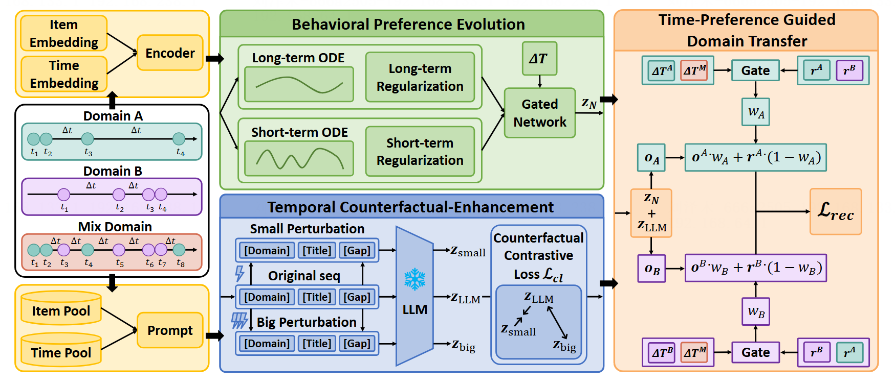

# Bridging Behavior and Semantics for Time-aware Cross-Domain Sequential Recommendation

Here is the official PyTorch implementation for the paper **"Bridging Behavior and Semantics for Time-aware Cross-Domain Sequential Recommendation"**, which has been accepted by **SIGIR '26**.

For more details, please refer to [https://dl.acm.org/doi/10.1145/3805712.3809733](https://dl.acm.org/doi/10.1145/3805712.3809733)

This project proposes a novel framework **BST-CDSR** to address the limitations of existing cross-domain sequential recommendation methods: (i) **ignoring domain-specific interaction frequencies and interest decay rates at identical time intervals**; and (ii) **treating semantic preferences as time-invariant during cross-domain transfer**. BST-CDSR designs a **behavioral preference evolution module** that decouples long-term interests and short-term intentions, and introduces a **temporal counterfactual-enhanced semantic generator** to capture time-aware semantic preferences. Moreover, a **time-preference guided domain transfer module** is designed to adaptively control transfer weights and mitigate negative transfer.

**Authors**: Zhida Qin, Zemu Liu, Haoyan Fu, Chong Zhang, Tianyu Huang, Yidong Li and Gangyi Ding. 

**Affiliation**: Beijing Institute of Technology, Xi'an Jiaotong University, Beijing Jiaotong University.

## Architecture

The overall architecture of BST-CDSR consists of three main parts: **Behavioral Preference Evolution**, **Temporal Counterfactual-Enhanced Semantic Preference Generator** and **Time-Preference Guided Domain Transfer**



## Requirements

The code is implemented using **PyTorch**. The mainly required packages are listed below:

```
Python = 3.7.9
PyTorch = 1.10.1
Scipy = 1.7.3
Numpy = 1.21.6
```

## Train

You can download the raw datasets from this [link](http://jmcauley.ucsd.edu/data/amazon/index_2014.html) and use the codes in the `preprocess` directory to process them. 

To ease the reproducibility of our paper, we also upload the preprocessed datasets to this [Google Drive](https://drive.google.com/drive/folders/1VGGBAObMTZ1M3yWnuWGLbUdc_5mGyPLQ). You can download the datasets, unzip them and place them in the `dataset` directory.

You can train **BST-CDSR** through the following commands.

```
CUDA_VISIBLE_DEVICES=0 python train_rec.py --data_dir Food-Kitchen
```

## Reference

If you find this repo helpful to your research, please cite our paper:

```
@inproceedings{BST-cdsr,
  title={Bridging Behavior and Semantics for Time-aware Cross-Domain Sequential Recommendation},
  author={Zhida Qin, Zemu Liu, Haoyan Fu, Chong Zhang, Tianyu Huang, Yidong Li and Gangyi Ding},
  booktitle={Proceedings of the 49th International ACM SIGIR Conference on Research and Development in Information Retrieval (SIGIR '26)},
}
```

